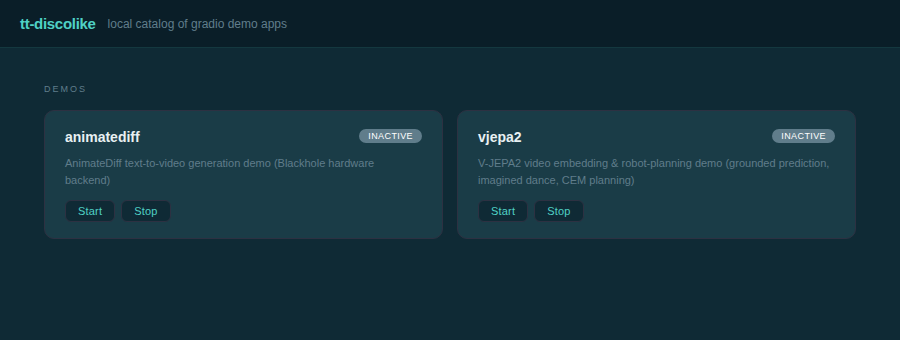

# tt-discolike

tt-discolike is a local catalog and launcher for gradio demo apps built on
Tenstorrent hardware. Tenstorrent chips are scarce, and one-off gradio demos
(e.g. `tt-vjepa2`, `tt-animatediff`) tend to get built once, shown off, and
then forgotten because there's no easy way to bring them back up later.
tt-discolike turns "what demos do I have, and can I pull one up right now" into
a one-click question: it scans your repos for a small manifest file, lists
what it finds in a web page, and lets you start/stop each app as a
`systemd --user` unit, with an optional handoff to `gozer` for chip leasing.



Named after, and loosely inspired by, [Disco](https://disco.cloud/) — an
open-source self-hosted PaaS (git-push deploys, Docker Swarm-based). This is
**not** the Disco daemon: Disco's execution model is Docker Swarm-only, which
conflicts with how Tenstorrent hardware actually gets used here — chip
passthrough into containers is fragile, and `gozer` (this box's chip-leasing
tool) tracks leases by host PID, not container PID namespace. tt-discolike
borrows Disco's UX idea — a catalog of apps you can bring up and down — as a
plain `systemd --user` process launcher instead. See
[`docs/superpowers/specs/2026-09-03-tt-disco-design.md`](docs/superpowers/specs/2026-09-03-tt-disco-design.md)
for the full design rationale.

## Install

```bash
git clone git@github.com:tsingletaryTT/tt-discolike.git
cd tt-discolike
pip install -e ".[dev]"
```

Requires Python 3.10+ and a Linux box running `systemd --user` (the launcher
target). `gozer` is an optional runtime dependency — see below.

## The manifest: `.disco/app.yaml`

Any repo becomes a catalog entry by dropping a `.disco/app.yaml` file at its
root:

```yaml
name: vjepa2
description: V-JEPA2 video embedding demo
port: 7860
chips: 1          # optional; advisory only, passed to gozer if present
launch: .venv/bin/python gradio_app/app.py
```

| Field         | Required | Meaning                                                                 |
|---------------|----------|--------------------------------------------------------------------------|
| `name`        | yes      | Catalog identifier. Must match `[A-Za-z0-9_.-]+` — it becomes the systemd unit name (`discolike-<name>.service`) and is shell-quoted into a `gozer --who` argument, so path separators and quote characters are rejected. |
| `description` | yes      | Free text shown in the catalog table.                                   |
| `port`        | yes      | The port the app's own server listens on. Used to build the catalog's "Open" link (`http://localhost:<port>`). |
| `launch`      | yes      | Shell command that starts the app, run with cwd set to the app's own directory (the manifest's parent's parent). A relative executable path (e.g. `.venv/bin/python`) is resolved to an absolute path against that directory before being placed in the generated systemd unit — systemd's `ExecStart=` rejects a relative path containing a slash. |
| `chips`       | no       | Number of Tenstorrent chips this app wants. Purely advisory: tt-discolike does not validate or reserve anything itself. If `gozer` is on `$PATH` *and* `chips` is set, the launch command is wrapped with `gozer run --chips <N> ...` (see below). If either condition is false, `launch` runs completely unmodified. |

Two names cannot collide: if two manifests under the scanned root declare
the same `name`, only the first one found (by manifest path sort order) is
treated as valid — every later one is shown in the catalog as a broken entry
naming the manifest it collided with, rather than silently sharing one
systemd unit.

## Discovery

On every page load, tt-discolike scans a configured parent directory for
`*/.disco/app.yaml` (one level deep) and treats each match as a catalog
entry:

- Scan root: `DISCOLIKE_SCAN_ROOT` environment variable, default `~/code`.
- A manifest that fails to parse (bad YAML, missing required field, invalid
  `port`/`chips`, invalid `name`) shows up as a "broken" row with the parse
  error, instead of aborting discovery for every other app.

There is no central registry to edit — adding an app is just committing a
manifest to its own repo.

## Running the catalog

Install the package (editable, for development: `pip install -e .`) and run
the `discolike` console-script entry point:

```bash
discolike
```

Configuration is via environment variables:

- `DISCOLIKE_HOST` — interface to bind, default `127.0.0.1`.
- `DISCOLIKE_CATALOG_PORT` — port to serve the catalog page on, default `8760`.
- `DISCOLIKE_SCAN_ROOT` — parent directory to scan for manifests, default `~/code`.

The catalog is a small FastAPI app (`discolike/main.py` → `discolike/app.py`)
serving one page (`GET /`) built from htmx fragments — clicking Start/Stop
(`POST /apps/{name}/start` / `POST /apps/{name}/stop`) re-renders just the
table via an HTML partial, no full page reload and no frontend build step.
There is no separate JSON API; the page and its buttons are the only
interface.

Starting an app renders and installs a `systemd --user` unit
(`discolike-<name>.service`) from the manifest's `launch` command, then runs
`systemctl --user daemon-reload` + `start`. Stopping runs
`systemctl --user stop`. Status is read via `systemctl --user is-active`,
and deeper diagnostics are a `journalctl --user -u discolike-<name>.service`
away — tt-discolike itself only reflects the immediate start/stop command's
success or failure in the catalog row, it does not tail logs.

## gozer: a soft dependency

[`gozer`](https://en.wikipedia.org/wiki/Gozer) is this box's chip-leasing
tool. tt-discolike treats it as entirely optional:

- If the `gozer` binary is found on `$PATH` **and** the manifest declares
  `chips`, the generated `ExecStart` wraps the launch command:
  `gozer run --chips <N> --who "discolike:<name>" --reason "gradio demo" -- <launch>`.
- Otherwise `launch` runs directly, unmodified.

This means the exact same tt-discolike install works unchanged for someone
without Tenstorrent hardware, or without gozer installed — `chips` is
simply ignored in that case. Both the `gozer` binary itself and the wrapped
launch command are resolved to absolute paths before being written into the
unit file, since systemd's user manager runs with a restricted `$PATH` that
does not include `~/.local/bin` (a real bug hit during integration testing:
`gozer` resolved bare in `ExecStart` and systemd failed with `203/EXEC`
because it couldn't find it).

## Gotcha: `GRADIO_SERVER_PORT` and the "Open" link

The catalog's "Open" link is built from the manifest's declared `port` —
tt-discolike never asks the running app what port it actually bound. Most
gradio apps respect `server_port` as passed by their own code, but an app
that does **not** hardcode `server_port` will fall back to gradio's own
"find a free port" behavior if the declared port happens to be busy when it
starts. When that happens, the app ends up listening on some other port
entirely, silently diverging from what the catalog's link expects — the
"Open" link then points at nothing (or at an unrelated service on that
port).

This bit `tt-vjepa2` during integration testing. The fix belongs at the
manifest/app level, not in tt-discolike itself: force the port via an
environment variable in the `launch` command so the declared and actual
ports are always the same, e.g.:

```yaml
launch: bash -c 'export GRADIO_SERVER_PORT=7861; exec .venv/bin/python gradio_app/app.py'
```

If you're onboarding a new gradio app to tt-discolike, either hardcode
`server_port=<manifest port>` in the app's own `demo.launch(...)` call, or
use the `GRADIO_SERVER_PORT=<port>` pattern above in `launch` — whichever
is easier to keep in sync with the manifest's `port` field.

## Testing

```bash
pytest
```

30 tests, no hardware or `systemd`/`gozer` dependency required — the one
exception (`test_render_unit_file_is_loadable_by_systemd_without_gozer`)
shells out to `systemd-analyze verify` and is skipped automatically if that
binary isn't on `$PATH`.

## License

Apache License 2.0 — see [`LICENSE`](LICENSE) and [`NOTICE`](NOTICE).
